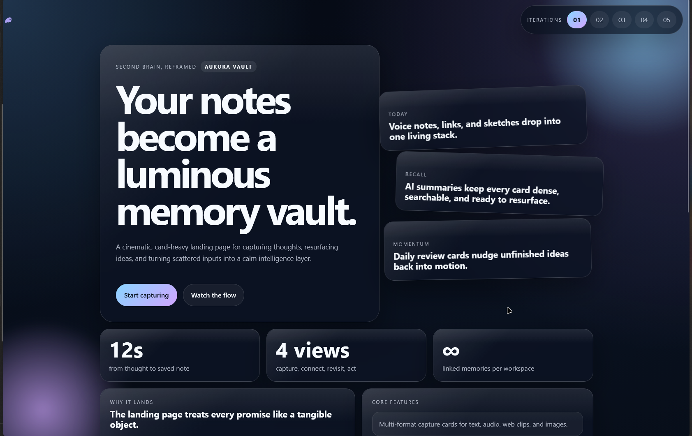
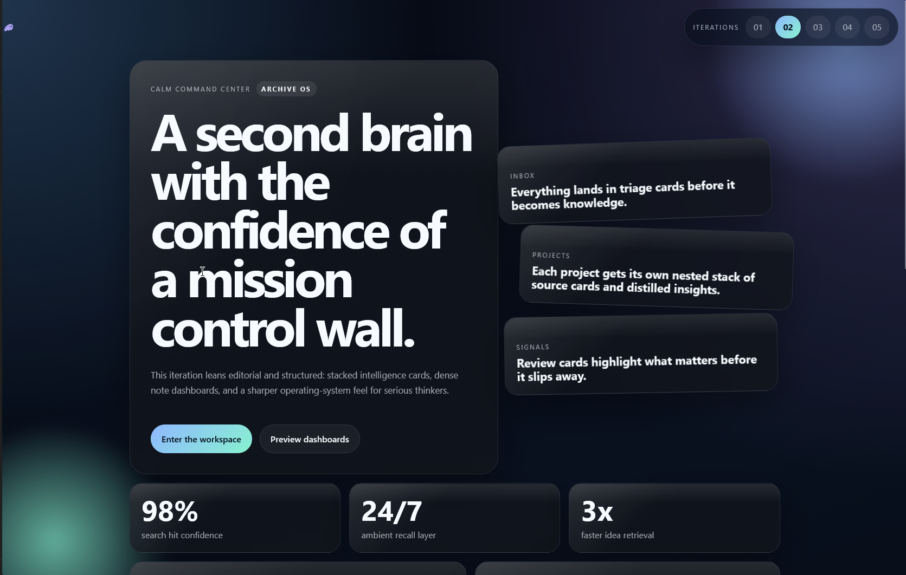

# Card First Design, why try to fight the cards when you can just replace them??

In the beginning there was nothing, and then Sam Altman gave us cards.

This repository is a **Next.js** shrine to the note-taking landing page as a stack of blessed rectangles—because fighting the card is heresy, and replacing the entire interface with more cards is *liturgy*. Here we explore variant routes, a variant switcher, and the creeping truth that if it can be a card, it was always meant to be a card.

## Canon (visual evidence)

Behold the zen. If your hero does not feel like a dramatic composition of confident surfaces over a full-bleed void, go back and add cards until the spirit moves you.





## The skill

The full dogma lives in [`.cursor/skills/lore-accurate-frontend-design/SKILL.md`](.cursor/skills/lore-accurate-frontend-design/SKILL.md). Apply it when building or styling UIs and you too can achieve hierarchy through **scale, depth, layering, contrast, and density**—all of which are card-flavored synonyms for “more cards.”

## Running the app (mundane but necessary)

```bash
npm install
npm run dev
```

Then open what Next prints (usually `http://localhost:3000`) and walk the numbered variant pages like a pilgrim through a gallery of nested divinity.

---

*Branding must remain unmistakable through heavy card usage. Mobile layouts should still feel premium, lest the cards abandon you on the narrow path.*
